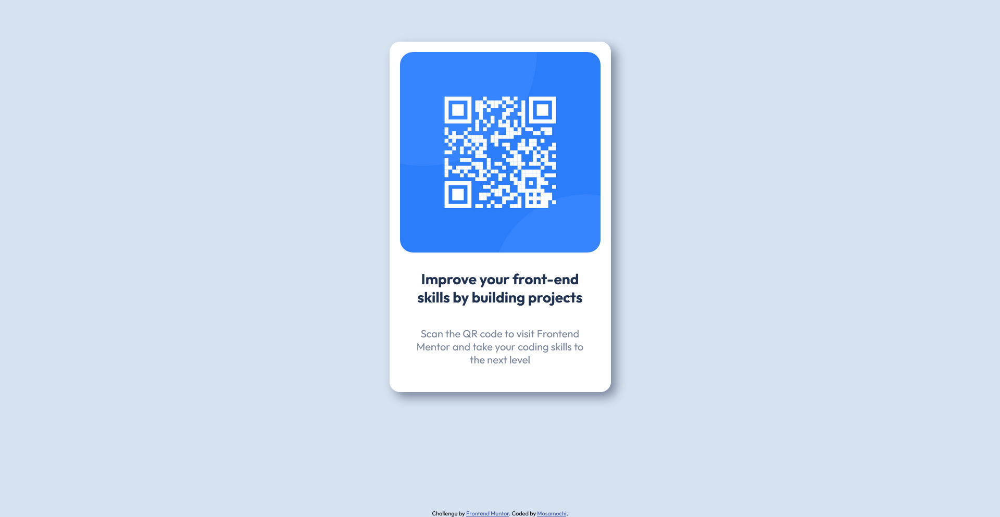

# Frontend Mentor - QR code component solution

This is a solution to the [QR code component challenge on Frontend Mentor](https://www.frontendmentor.io/challenges/qr-code-component-iux_sIO_H). Frontend Mentor challenges help you improve your coding skills by building realistic projects. 

## Table of contents

- [Overview](#overview)
  - [Screenshot](#screenshot)
  - [Links](#links)
- [My process](#my-process)
  
  - [What I learned](#what-i-learned)
  
- [Author](#author)
- [Acknowledgments](#acknowledgments)

**Note: Delete this note and update the table of contents based on what sections you keep.**

## Overview

### Screenshot



### Links

- Solution URL: [Add solution URL here](https://your-solution-url.com)
- Live Site URL: [Add live site URL here](https://your-live-site-url.com)

## My Process
### What I learned

This is my first attempt at a Frontend Mentor challenge! I'm more comfortable working with Javascript so this challenge was a good opportunity to dust off the CSS/design side. I decided to give SASS a shot (my first time!) so you can see some @mixins at play. I also tried to practice Semantic HTML. 
 
I struggled a bit remembering how flexbox works but [CSS-Tricks](https://css-tricks.com/snippets/css/a-guide-to-flexbox/) got me through it. My greatest challenge was figuring out how to have that footer stick to the bottom of the page, I was pretty relieved when I finally got that working. I accomplished it by setting the ```html``` and ```body``` elements at 100% height and then setting up a flexbox column where the footer does not shrink but your content does. This allows for the content to grow to take up the full height of the window and prevents the footer from shrinking. 
I took some creative liberties to add a box shadow under the white box (which i removed in the mobile view) but otherwise tried to stick to the example design. 
All in all, I had fun and definitely learned/relearned some CSS concepts and I am excited for the next challenge I undertake!


## Author


- Frontend Mentor - [@mosamochi](https://www.frontendmentor.io/profile/mosamochi)

